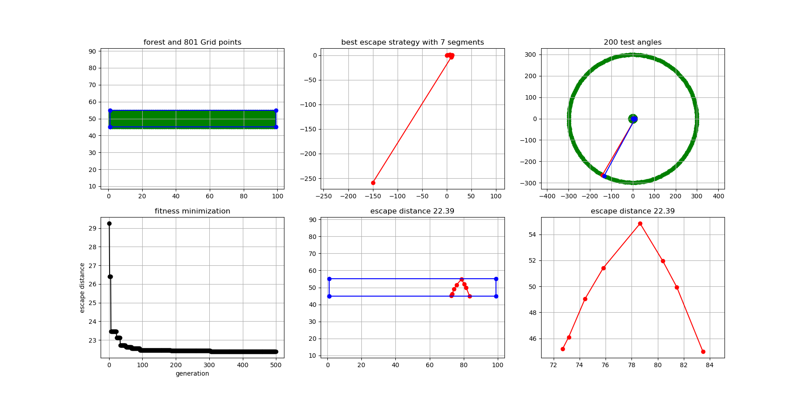

README (everything you see here is a work in progress)

COMPILE
compile with the following: gcc BellmansForest.c -Wall -Werror --std=c99 -lm -O3 -o Bellman

TO DO
refacor the code to parallelize. Unfortunately, not enough forethrought was put into running in parallel, on the other hand, refactoring is not terribly
difficult. I may also refator to take advantage of cuda C. Thus, this program is simply a proof of concept in its current form. With better data structures, 
I suspect cuda C could speed up the program 100 fold. But I'm doing other shit right now and will get to it later. This code does not preform particularly 
well at the moment but provides a foundation. I'f you'd like to use this code academically let me know. 

WHAT THIS PROGRAM DOES
A genetic algorithm approach to solving Bellman's lost-in-a-forest problem written in C. This was a weekend project that I might revisit in the near future. 
Briefly, escape paths are represented by pairs of distances and angles (r,theta). A hypotherical escape path with three segments would look something like:
(0.000, 0.501) -> (2.056, 1.462) -> (1.456, 300). This represents the set of instructions to turn 0.000 radians and walk straight for 0.501 units, turn 2.056
radians and walk straight for 1.462 units, turn 1.456 radians and walk straght for 300 units. In the code, the number of segments (3 here) is loosly called
degrees of freedom. Note, the first turn angle is irrelevent and set to 0; and, the last instruction has a radius of 300 ensuring we exit the forest. The code
generates a population of these "random walks" and uses a genetic algorithm to try different combinations of (r,theta). The goal is to minimize the worste case 
scenario when escaping from the forest. The program works by laying grid points over the forest, then rotating the escape path at each test point to find the 
worste case scenario. Sometimes the escape path is converted to cartesian coordinates and back to polar for detecting forest escape and inserting new points 
into the path. Some of these sections of code are ugly and it may be that a simpler approach can parameterize the escape paths with (x,y) offsets rather than 
(r,theta). This could simplify the approach and possible speed up the search.

OUTPUT:
The program produces two output streams: one to stdout and the other to stderr. The former produces a dataframe with point data over three columns: x, y, and
type of point. The latter provides a progress update for each generation of the genetic algorithm. The program makes a final check of the minimized distance
which is printed to stderr. The plotForest.py script is designed to plot the contents of stdout (see below).

OPTIONS:
--gridsize <float> tells the program how to space test points in the forest. 
--segments <int> tells the program how many segments to use in the escape path.
--forest <string> supply a filename containing verticies of the forest (see below)
--generations <int> tells the program how many generations to run the genetic algorithm
--angles <int> tells the program how many test angles to use when testing the escape paths
--hull <int> if you do not supply a forest function you can generate a forest with the hull option.
	The program will generate a pseudo-random forest with the number of requested verticies.
--population <int> number of individuals in the population
--children <int> tells the program how many offspring to make each generation using the
	current generation as parents
--survivors <int> tells the program how many individuals each generation survive to the next 
	generation. Note that the population must be >= children + survivors.

NOTES ON PROVIDING A CUSTOM FOREST:
	a custom forest can be provided as a text file with each x-y vertex listed counterclockwise. for example, A square forest can be defined as follows:

	30.00   30.00
	60.0    30.00
	60.0    60.00
	30.00   60.00

	it is recommended to put the forest in the first quadrant with coordinates < 100. The forest does not have to be convex. Behavior has not been tested
	for disconnected forests. The size of the forest should not exceed 1000 verticies. Several forests are provided in this repo. 

EXAMPLES:

	find the best escape path for a rectangular forest. Use 7 segments in the escape, a grid size of 1.1, and 200 test angles. Optimize for 500 generations.
	Save the data to "forestData.txt" file.
	./Bellman --gridsize 1.1 --segments 7 --forest rectangle.txt --generations 500 --angles 200 > forestData.txt

	find the best escape path for an isosceles triangle forest. Use 3 segments in the escape, a grid size of 1.0, and 200 test angles. Optimize for 100 
	generations. Save the data to "forestData.txt" file.
	./Bellman --gridsize 1.0 --segments 3 --forest isosceles.txt --generations 100 --angles 200 > forestData.txt

	find the best escape path for a random triangular forest. Use 3 segments in the escape, a grid size of 1.0, and 200 test angles. Use a population size 
	of 200 with 100 children and 80 survivors each generation. Save the data to "forestData.txt" file.
	./Bellman --gridsize 1.0 --segments 3 --hull 3 --generations 100 --angles 200 --population 200 --children 100 --survivors 80 > forestData.txt
	
PLOTTING:
	stdout produces a dataframe with point data over three columns: x, y, and type of point. If redirected to a file (forestData.txt) a plotting function
	is provided to visualize the results of the optimization:
	
	python3 plotForest.py
	
	This will create a figure (combined_plot.png) with 6 subplots
	1) the forest with grid points.
	2) the best escape strategy including the elongated final radius
	3) the escape strategy rotated around the test points (used for error checking)
	4) the worste case scenario for each generation of the run.
	5) the final best escape strategy plotted inside the forest
	6) zoom view of the best escape strategy

